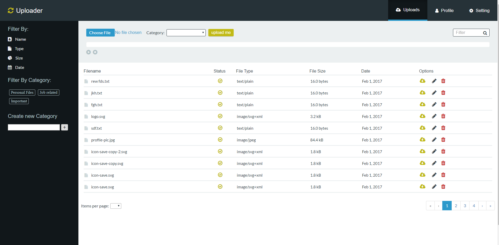

# Gulp Workflow

I've gone through the basics of Gulp and created a workflow that's able to compile Sass into CSS while watching HTML and JS files for changes at the same time. We can run this task with the `gulp` command in the command line.

I've also built a second task, **build**, that creates a **dist** folder for the production website. It compiled Sass into CSS, optimized all our assets, and copied the necessary folders into the dist folder. To run this task, we just have to type `gulp build` into the command line. And to see optimized version just start CMD in **dist** folder and type `http-server -a localhost -p 8000 -c-1` and given address in browser

Also, for this task I added mocked server which we can start as instruction below show

* Spins up a web server
* Compiles Sass to CSS
* Using Autoprefixer to write vendor-free CSS code
* Refreshes the browser automatically whenever you save a file
* Optimizes all assets (CSS, JS, fonts, and images) for production
* Convert a set of images into a spritesheet and CSS variables via gulp

##Instructions

Make sure you have these installed

1. [Node.js](www.nodejs.org).
2. [git](www.git-scm.com).
3. Gulp via the Mac terminal or CMD on a PC > `npm install -g gulp`
4. Bower via the Mac terminal or CMD on a PC > `npm install -g bower`
5. JSON server via the Mac terminal or CMD on a PC > `npm install -g json-server`
6. HTTP-server via the Mac terminal or CMD on a PC  > `npm install http-server`

Copy this repository into your local machine

CD to the folder with workflows
Run > `npm install` in CMD while in root of the workflow directory to install the project dependencies
Run > `bower install` to install the project dependencies
Run > `json-server --watch db.json` via CMD in `app\js` folder to start mocked server

Run the Gulp command > `gulp` in root directory of Project. Because I used AngularJS browsersync will open Project on this address `http://localhost:8080/` so we need to manually add hashtag to the end like this `http://localhost:8080/#/` to see our Project

`http://localhost:8080/#/` to you browser to live preview your work
